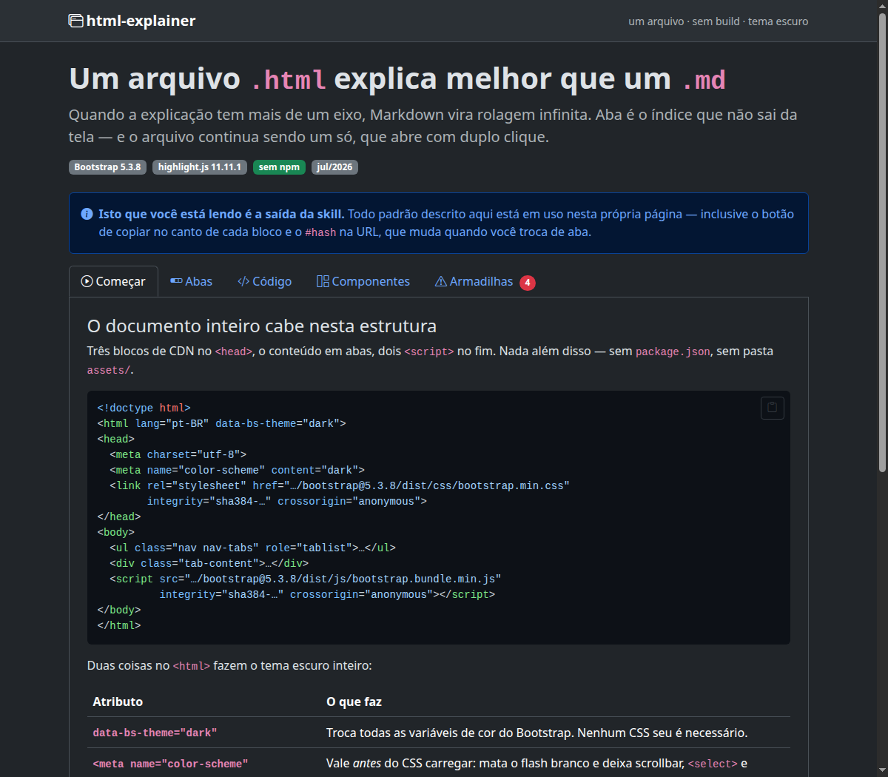

# html-explainer

Uma [Agent Skill](https://code.claude.com/docs/en/skills) que faz um agente de código **parar de
responder em Markdown** e entregar **um arquivo `.html`** — conteúdo separado em abas, tema escuro,
código destacado com botão de copiar, tudo por CDN.

Sem `npm install`, sem bundler, sem pasta de assets. Um arquivo que abre com duplo clique, vai por
anexo de e-mail e funciona offline no navegador de quem receber.



## O problema

Markdown empilha tudo numa coluna infinita. Quando a explicação tem mais de um eixo — a visão geral,
o código, o passo a passo, as armadilhas, cada linguagem, cada ambiente — o leitor rola procurando.

**Aba é o índice que não sai da tela.** E um `.html` de arquivo único é a única forma de entregar
isso sem exigir build, servidor ou repositório do outro lado.

## O que a skill entrega

| | |
|---|---|
| **Template pronto** | `assets/template.html` — CDN com SRI conferido, estrutura de abas com ARIA correta, runtime de highlight + cópia + deep-link. Copiar e preencher. |
| **Exemplo completo** | `assets/example.html` — um documento de verdade usando todos os padrões que descreve. É a demonstração e a documentação. |
| **Linter** | `scripts/check-doc.mjs` — reprova par ARIA quebrado, duas abas ativas, `<` não escapado, versão flutuante de CDN, arquivo externo ao lado. |
| **Gerador** | `scripts/new-doc.mjs "Título" saida.html --tabs "A,B,C"` — monta a casca com os `id`/`aria-*` já pareados. |
| **Escapador** | `scripts/escape-code.mjs arquivo.ts --lines 40-58` — vira um `<pre><code>` pronto para colar. |
| **Referências** | CDN e SRI · abas e ARIA · blocos de código · componentes Bootstrap · armadilhas · como escrever o texto. |

Tudo em `references/` é lido sob demanda: o `SKILL.md` é curto e aponta para o arquivo certo quando
o caso aparece.

## Instalação

```bash
git clone https://github.com/frederico-kluser/html-explainer-skill.git
cd html-explainer-skill
./install.sh
```

O instalador cria um **symlink** em cada diretório de agente que existir na máquina — Claude Code,
Codex, Copilot, OpenCode, Gemini CLI, Cursor. Não copia nada: editar o `SKILL.md` aqui passa a valer
na hora, em todos, sem deploy.

```bash
./install.sh --check       # o que faria, sem alterar nada
./install.sh --uninstall   # remove os links (nunca toca em diretório real)
```

Depois é só pedir em linguagem natural — *"me explica isso num HTML"*, *"monta um documento em
abas"*, *"documenta essa API"* — que a skill dispara sozinha.

## Uso direto, sem agente

Os scripts funcionam como ferramenta de linha de comando (Node ≥ 18, zero dependências):

```bash
node html-explainer/scripts/new-doc.mjs "Como o cache invalida" ./cache.html \
     --tabs "Resposta,Como funciona,Armadilhas" --sub "v3 · jul/2026"

# preencha o conteúdo…

node html-explainer/scripts/check-doc.mjs ./cache.html
```

```
✓ cache.html — sem problemas
```

## O que está dentro do documento gerado

- `<html data-bs-theme="dark">` + `<meta name="color-scheme" content="dark">` — escuro de verdade,
  sem flash branco e sem alternador de tema.
- **Bootstrap 5.3.8** por jsDelivr, **highlight.js 11.11.1** por cdnjs, ambos com `integrity` +
  `crossorigin` e **versão travada** — versão flutuante quebra o SRI no dia do release.
- **Botão de copiar** em cada bloco, com `navigator.clipboard` quando há contexto seguro e fallback
  `execCommand` quando não há. O texto cru é capturado *antes* do highlight, para não colar os
  números de linha junto.
- **Aba ↔ URL nos dois sentidos**: `arquivo.html#pane-armadilhas` abre naquela aba; trocar de aba
  atualiza o hash sem fazer a página pular.
- **Impressão com todas as abas abertas** — sem isso, o PDF de um documento de 5 abas sai com 1.

## Verificado, não presumido

Os números da documentação foram medidos em Chromium/Brave sobre `file://`, não copiados de blog.
Dois exemplos:

- **Diagrama em aba escondida quebra.** Mermaid 11.16, dois diagramas idênticos: no painel visível o
  SVG sai com `viewBox="0 0 340.45 70"`; no painel escondido, `viewBox="-8 -8 16 16"` — uma caixa de
  16×16, porque `getBBox()` devolve zero dentro de `display: none`. A correção (renderizar no
  `shown.bs.tab`) está no exemplo e devolve `viewBox="0 0 332.75 70"`.
- **`file://` é contexto seguro no Chromium** — `window.isSecureContext === true` e
  `navigator.clipboard` existe. O fallback do botão de copiar continua necessário, mas por causa de
  `http://` em IP de rede local, não do `file://`. Metade dos tutoriais erra nisso.

## Quando *não* usar

Página de produto, landing, aplicação com estado, site com build — e o caso em que o arquivo vai
virar `README.md` ou entrar em `docs/`. Na dúvida entre `.md` e `.html`: se é para **ler**, HTML;
se é para **versionar e revisar em PR**, Markdown.

## Licença

MIT.
